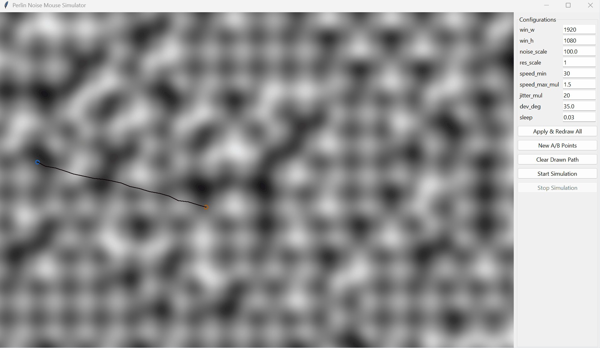

# Perlin-Mouse-Simulator

[](https://opensource.org/licenses/MIT)

A Python application that simulates human-like mouse movement from a starting point (A) to an ending point (B) on the screen. The movement is influenced by Perlin noise to create a more natural, less robotic path. The application features a Tkinter-based GUI for real-time visualization of the noise field, the path, and for configuring simulation parameters. The actual system mouse cursor is controlled using PyAutoGUI.



## Features

*   **Perlin Noise-Based Movement:** Generates smooth, natural-looking random paths.
*   **Real-time Mouse Control:** Uses `pyautogui` to move the system mouse cursor.
*   **Interactive Tkinter GUI:**
    *   Visualize the Perlin noise field.
    *   Display start (A) and end (B) points.
    *   Draw the simulated mouse path in real-time.
    *   Configure parameters like noise scale, speed, jitter, deviation, and window size.
*   **Configurable Parameters:** Adjust various aspects of the simulation via the GUI.

## Requirements

*   Python 3.7+
*   Conda (for environment management)
*   Tkinter (usually included with Python standard library)
*   Pillow (PIL)
*   NumPy
*   PyAutoGUI

## Installation

1.  **Clone the repository:**
    ```bash
    git clone https://github.com/WalkingDevFlag/Perlin-Mouse-Simulator.git
    cd Perlin-Mouse-Simulator
    ```

2.  **Create and activate a Conda virtual environment (recommended):**
    ```bash
    conda create -n pms_env python=10
    conda activate pms_env
    ```

3.  **Install dependencies:**
    It's recommended to install PyAutoGUI via pip even in a Conda environment for the latest versions or if Conda channels are problematic. Other packages can be installed via Conda or pip.
    ```bash
    pip install -r requirements.txt
    # Or, if you prefer to install main packages via conda:
    # pip install pyautogui pillow numpy
    ```

## Usage

Run the main application script from the root directory of the project:

```bash
python src/main.py
```

This will launch the Tkinter GUI.
1.  Adjust configuration parameters on the right-hand panel if needed.
2.  Click "**Apply & Redraw All**" to apply new configurations and regenerate the noise field and A/B points.
3.  Click "**New A/B Points**" to randomly select new start and end points on the current noise field.
4.  Click "**Start Simulation**" to begin the mouse movement.
5.  Click "**Stop Simulation**" or press the **`Esc`** key to halt an ongoing simulation.
6.  Click "**Clear Drawn Path**" to remove the black path lines from the canvas.

## Project Structure

```
Perlin-Mouse-Simulato/
├── src/
│   ├── perlin_noise.py     # Contains the Perlin class for noise generation
│   ├── app_gui.py          # Contains the App class for GUI and simulation logic
│   └── main.py             # Main script to launch the application
├── requirements.txt        # Project dependencies
├── LICENSE                 # Project license (MIT)
└── README.md               # This file
```

## Configuration Parameters

The following parameters can be configured through the GUI:

*   **`win_w`, `win_h`**: Width and height of the application window.
*   **`noise_scale`**: Scale of the Perlin noise (higher values mean more zoomed-out/smoother noise).
*   **`res_scale`**: Resolution scale for generating the noise map (0.01 to 1.0). Lower values are faster to compute but less detailed.
*   **`speed_min`**: Minimum pixels moved per step.
*   **`speed_max_mul`**: Multiplier for additional speed derived from noise value.
*   **`jitter_mul`**: Multiplier for random jitter strength.
*   **`dev_deg`**: Maximum angular deviation (in degrees) influenced by noise.
*   **`sleep`**: Sleep time (in seconds) between mouse movement steps.

## Future Ideas / Improvements

*   [ ] Option to save/load configurations.
*   [ ] Click on canvas to set A and B points.


# Project Notes and References

## Mouse Functions (Potential Library Features)

These are functions that could potentially be developed into a standalone mouse control library.

-   `move_cursor(x, y)` - Move the mouse pointer to the specified coordinates.
-   `get_cursor_position()` - Return the current position of the mouse pointer.
-   `click(button='left', x=None, y=None, clicks=1, interval=0)` - Perform a mouse click (left, right, or middle) at the current or specified position.
-   `double_click(button='left', x=None, y=None)` - Perform a double-click.
-   `right_click(x=None, y=None)` - Shortcut for a right-click.
-   `middle_click(x=None, y=None)` - Shortcut for a middle-click.
-   `press_button(button='left', x=None, y=None)` - Press and hold a mouse button down.
-   `release_button(button='left', x=None, y=None)` - Release a mouse button.
-   `drag_to(x, y, duration=0)` - Drag the mouse to a specific position.
-   `drag_by(dx, dy, duration=0)` - Drag the mouse by a relative amount.
-   `scroll(vertical=0, horizontal=0)` - Scroll vertically or horizontally.
-   `hover(x, y)` - Move the mouse to a position and pause to simulate a hover.
-   `select_area(x1, y1, x2, y2)` - Select a rectangular area (for selection or drag operations).

## Common Screen Resolutions (Reference)

A list of common screen resolutions for reference purposes.

| Label           | Resolution  | Aspect Ratio (Approx) |
|-----------------|-------------|-----------------------|
| SD (Standard)   | 640 x 480   | 4:3                   |
| HD              | 1280 x 720  | 16:9                  |
| WXGA            | 1366 x 768  | 16:9                  |
| Full HD (FHD)   | 1920 x 1080 | 16:9                  |
| WUXGA           | 1920 x 1200 | 16:10                 |
| QHD/2K          | 2560 x 1440 | 16:9                  |
| WQXGA           | 2560 x 1600 | 16:10                 |
| 4K UHD          | 3840 x 2160 | 16:9                  |
| 8K UHD          | 7680 x 4320 | 16:9                  |

## Ideal Perlin Mouse Simulator Configuration

This represents a preferred configuration for the Perlin Mouse Simulator application.

```python
# Ideal Configuration Values
config = {
    "win_h": 1560,         # Window width
    "win_w": 2560,         # Window height 
    "noise_scale": 100.0,  # Scale of the Perlin noise
    "res_scale": 1.0,      # Resolution scale for the noise map (1.0 = full resolution)
    "speed_min": 20.0,     # Minimum pixels moved per step
    "speed_max_mul": 2.0,  # Multiplier for additional speed from noise
    "jitter_mul": 20.0,    # Multiplier for random jitter strength
    "dev_deg": 35.0,       # Maximum angular deviation (in degrees)
    "sleep": 0.03          # Sleep time (in seconds) between steps
}
```

## License

This project is licensed under the MIT License - see the [LICENSE](LICENSE) file for details.
